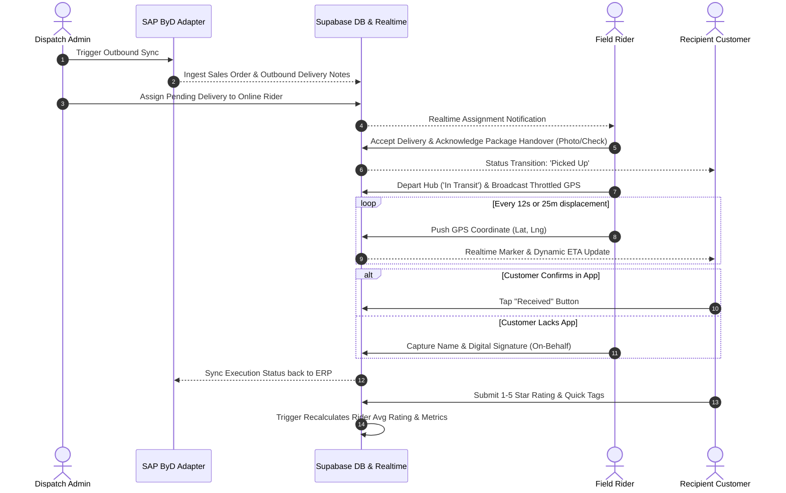

# System Architecture & Technical Specifications

## 1. High-Level Architectural Topology

```mermaid
graph TD
    subgraph ClientPWA [Client-Side Progressive Web App (React 18 + Vite + TS)]
        RiderView["Rider Interface (/rider/*)"]
        CustomerView["Customer Interface (/customer/*)"]
        AdminView["Admin Dashboard & TV Board (/admin/*)"]
        GeoBroadcast["Throttled GPS Broadcaster (12s/25m)"]
        PWAWorker["Service Worker (Workbox Cache-First & Offline)"]
    end

    subgraph SupabaseCloud [Supabase Cloud Platform (Zero-Cost Free Tier)]
        AuthService["Supabase Auth (JWT Claims + RLS Context)"]
        PostgresDB[("PostgreSQL 15 (14 Tables + RLS Policies + Triggers)")]
        RealtimeEngine["Supabase Realtime (WebSockets: Chat & GPS)"]
        StorageEngine["Supabase Storage (Signatures & Handover Proofs)"]
    end

    subgraph EdgeLayer [Supabase Deno Edge Functions]
        SyncFunc["sap-byd-sync (OData Ingestion Worker)"]
        PushFunc["send-push (VAPID Web Push Gateway)"]
    end

    subgraph ExternalIntegrations [External Services]
        GoogleMaps["Google Maps Platform (JS API / Directions)"]
        SAPByD["SAP Business ByDesign (OData v2 Outbound Logistics)"]
        WebPush["Web Push Gateway (Push Service)"]
    end

    RiderView --> AuthService
    RiderView --> PostgresDB
    RiderView --> RealtimeEngine
    RiderView --> StorageEngine
    RiderView --> GeoBroadcast

    CustomerView --> AuthService
    CustomerView --> PostgresDB
    CustomerView --> RealtimeEngine
    CustomerView --> GoogleMaps

    AdminView --> AuthService
    AdminView --> PostgresDB
    AdminView --> RealtimeEngine

    SyncFunc --> SAPByD
    SyncFunc --> PostgresDB

    PushFunc --> WebPush
    PushFunc --> PostgresDB
```

---

## 2. Real-Time Dispatch & Delivery Lifecycle



---

## 3. SAP Business ByDesign (ByD) Integration Pattern

The system uses an extensible **Adapter Pattern** to decouple frontend business logic from the ERP service layer:

```
src/features/sap-byd/
├── types.ts                    # Pure TypeScript interface definitions
├── SapBydClient.ts             # Factory and barrel exports
├── MockSapBydClient.ts         # High-fidelity mock adapter with realistic JSON fixtures
├── RealSapBydClient.ts         # Documented OData v2 client for live SAP ByD tenant
└── fixtures/
    └── delivery-notes.json     # Comprehensive fixture dataset (medical, parts, docs)
```

- **Zero application code changes required**: Switching between mock demonstration and production tenant is driven entirely by environment configuration (`VITE_SAP_BYD_USE_MOCK=true|false`).
- **Standard adherence**: `RealSapBydClient` implements the official SAP ByD OData v2 Outbound Delivery collection (`/sap/byd/odata/cust/v1/outbounddelivery/`).

---

## 4. Cost Control & Zero-Budget Guardrails

| Resource | Free Tier Limit | Production Strategy & Guardrail |
|---|---|---|
| **Google Maps Platform** | $200/mo free credit | • Throttled coordinate broadcasting (12s interval / 25m displacement)<br>• Directions API cached at 60s intervals<br>• Graceful fallback to SVG/Canvas interactive radar if key is absent or quota is reached |
| **Supabase** | 500MB DB, 2GB Bandwidth, 50k MAU | • Strict PostgreSQL indexes on query predicates<br>• Realtime broadcast channels filtered by ID<br>• Throttled DB writes |
| **Hosting (Vercel)** | 100GB Bandwidth (Hobby tier) | • Pure client-side static PWA build (Vite SPA)<br>• Service worker asset caching |
| **Push Notifications** | Free (Unlimited VAPID) | • Self-generated VAPID keys via Web Push standard |
