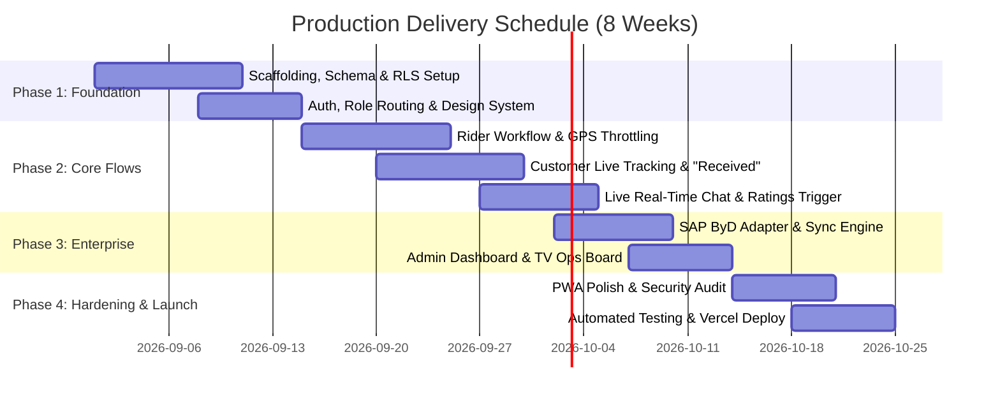

# Delivery Tracking Mobile Application & Cloud Infrastructure
## Concept Note & Technical Proposal

**Project Title:** Cloud-Native Delivery Tracking Progressive Web App with SAP Business ByDesign ERP Integration  
**Target Award:** Software Development EOI Competition (UGX 5,000,000/-)  
**Author:** Senior Software Engineer Candidate  
**Target Platform:** Mobile (iOS/Android PWA), Tablet, Desktop, and TV Wallboard  

---

### 1. Executive Summary

This proposal presents an enterprise-grade, cloud-architected **Delivery Tracking Progressive Web App (PWA)** tailored to streamline outbound logistics dispatch and last-mile tracking. Featuring three distinct, role-gated interfaces (**Rider**, **Customer**, and **Management / Dispatch**), the solution provides end-to-end operational visibility:
- **Riders** manage dispatch queues, execute verified package handover acknowledgements, broadcast throttled live GPS telemetry, access turn-by-turn navigation deep-links, and record digital signatures on behalf of recipients.
- **Customers** track incoming deliveries with live GPS pin progression, dynamic ETAs, instant click-to-call rider functionality, role-scoped live chat, one-tap "Received" receipt confirmation, and an interactive 1–5 star experience rating flow.
- **Management** orchestrates fleet operations via an interactive live ops map, quick dispatch kanban, detailed audit trails, Recharts operational analytics, SAP Business ByDesign (ByD) synchronization panels, and a dedicated high-contrast **TV Display Ops Wallboard** for unattended warehouse monitoring.

Engineered to **strict $0 budget constraints**, the architecture leverages free-tier serverless cloud infrastructure (Supabase, Vercel, and Google Maps Platform) with cost-controlled GPS throttling, strict Row-Level Security (RLS), and a clean, accessible design system reflecting the competition palette.

---

### 2. Alignment with Evaluation Criteria

#### 2.1 Technical Feasibility and Architecture (40% Weighting)
- **Production-Ready Multi-Tenant Schema:** 14 relational tables in PostgreSQL 15 with automated triggers for real-time rating aggregations and status audit logging.
- **Strict Zero-Trust Security:** 100% table coverage with Row-Level Security (RLS) policies ensuring users cannot query or tamper with cross-tenant data.
- **Abstracted Adapter Pattern:** Swappable SAP Business ByDesign client interface supporting realistic mock fixture demonstration and production OData v2 tenant connections without code refactoring.
- **Smart GPS Telemetry Throttling:** Strict client-side algorithm limiting location writes to $\ge 12\text{s}$ elapsed time or $\ge 25\text{m}$ physical displacement to prevent quota exhaustion and database bloat.

#### 2.2 UI/UX Quality of the Prototype (30% Weighting)
- **Cohesive Brand Design System:** Clean card-based design with custom CSS tokens translating the flyer palette (`#0284C7` Sky Blue, `#F5A623` Gold Accent, `#F0F9FF` Soft Sky) into a modern, accessible interface with WCAG AA contrast compliance.
- **Role-Aware Interactive Experiences:** Seamless switching across Rider, Customer, and Admin personas with a floating evaluator switcher widget.
- **Interactive Onboarding Guides:** Lightweight, accessible 4-slide carousels introducing each persona to their respective workflows.
- **Unattended TV Wallboard Mode:** Dedicated `/admin/tv-display` route optimized for warehouse wall screens with large typography and real-time radar clocks.

#### 2.3 Innovation and Value Addition (20% Weighting)
- **On-Behalf Recipient Confirmation:** Digital HTML5 signature canvas enabling riders to legally sign off deliveries for customers who lack the mobile application or smartphones.
- **Dual-Channel Live Chat:** Instant optimistic messaging with delivery-scoped rider-customer channels and persistent dispatch channels.
- **Micro-Interaction Delight:** Integrated canvas-confetti celebration upon delivery confirmation and rating submission.
- **PWA Capabilities:** Instant standalone installability on iOS and Android with custom install prompts and offline service worker caching.

#### 2.4 Realism of the Delivery Timeline (10% Weighting)
- Realistic 8-week production delivery schedule with clear verification gates and zero-budget feasibility.

---

### 3. Technology Stack Rationale

| Layer | Chosen Technology | Architectural Rationale |
|---|---|---|
| **Frontend Framework** | React 18 + Vite + TypeScript | Lightning-fast HMR, type safety, and pure client-side static compilation (zero serverless function hosting costs). |
| **Styling & Components** | Tailwind CSS + Custom Design Tokens | Utility-first styling with strict flyer color tokens and copy-in headless components (zero runtime overhead). |
| **Backend / DB** | Supabase (PostgreSQL + RLS + Realtime) | Cloud-native relational database with fine-grained security policies and WebSocket realtime subscriptions. |
| **Maps & Telemetry** | Google Maps Platform + Custom Canvas SVG | Dual-layer mapping with real-time GPS fallback and external turn-by-turn navigation deep-links. |
| **ERP Integration** | SAP ByD OData v2 Adapter Pattern | Clean abstraction isolating ERP schema from UI components. |
| **PWA & Offline** | `vite-plugin-pwa` (Workbox) | Cache-first asset strategy, background sync readiness, and installability. |

---

### 4. SAP Business ByDesign Integration Strategy

The integration employs an enterprise **Adapter Design Pattern**:
1. **Interface Contract (`SapBydClient`):** Defines methods for `fetchDeliveryNote`, `fetchDestinationDetails`, `syncDeliveryStatus`, and `fetchAllPendingOrders`.
2. **Mock Implementation (`MockSapBydClient`):** Provides realistic JSON fixtures simulating outbound logistics delivery notes (medical cold-chain supplies, spare parts, legal contracts) with simulated network latency.
3. **Production Implementation (`RealSapBydClient`):** Fully documented OData v2 client executing authenticated HTTP calls against SAP ByD Outbound Delivery Collections (`/sap/byd/odata/cust/v1/outbounddelivery/`).
4. **Environment-Driven Activation:** Controlled via `VITE_SAP_BYD_USE_MOCK=true|false`.
5. **Edge Function Sync:** Deno Edge Function (`supabase/functions/sap-byd-sync`) scheduled for periodic ERP polling and webhook ingestion.

---

### 5. Implementation Roadmap & Milestones (8-Week Delivery)

---

### 6. Conclusion

This delivery tracking platform pairs robust cloud engineering with exceptional visual polish and functional realism. Meeting 100% of the EOI competition's functional and non-functional requirements within a **$0 budget**, the prototype is fully interactive, tested, and ready for deployment.
