# Entity Relationship Diagram (ERD)

This document contains the complete PostgreSQL database schema for the **Delivery Tracking Progressive Web App**, reflecting all 14 core tables, custom enumerations, primary/foreign key relationships, and security constraints.

```mermaid
erDiagram
    PROFILES ||--o| RIDERS : "1:1 extension (role=rider)"
    PROFILES ||--o| CUSTOMERS : "1:1 extension (role=customer)"
    PROFILES ||--o{ DELIVERIES : "customer_id"
    PROFILES ||--o{ DELIVERIES : "rider_id"
    PROFILES ||--o{ DELIVERY_STATUS_HISTORY : "changed_by"
    PROFILES ||--o{ DELIVERY_ACKNOWLEDGEMENTS : "rider_id"
    PROFILES ||--o{ RECEIPT_CONFIRMATIONS : "confirmed_by_user_id"
    PROFILES ||--o{ CHAT_PARTICIPANTS : "user_id"
    PROFILES ||--o{ CHAT_MESSAGES : "sender_id"
    PROFILES ||--o{ RATINGS : "customer_id"
    PROFILES ||--o{ RATINGS : "rider_id"
    PROFILES ||--o{ NOTIFICATIONS : "user_id"
    PROFILES ||--o| ONBOARDING_STATUS : "user_id"
    PROFILES ||--o{ AUDIT_LOG : "actor_id"

    DELIVERIES ||--o{ DELIVERY_STATUS_HISTORY : "delivery_id"
    DELIVERIES ||--o| DELIVERY_ACKNOWLEDGEMENTS : "delivery_id"
    DELIVERIES ||--o| RECEIPT_CONFIRMATIONS : "delivery_id"
    DELIVERIES ||--o| CHAT_THREADS : "delivery_id"
    DELIVERIES ||--o| RATINGS : "delivery_id"
    DELIVERIES ||--o{ NOTIFICATIONS : "related_delivery_id"

    CHAT_THREADS ||--o{ CHAT_PARTICIPANTS : "thread_id"
    CHAT_THREADS ||--o{ CHAT_MESSAGES : "thread_id"

    PROFILES {
        uuid id PK "references auth.users(id)"
        text full_name
        text phone
        role_enum role "rider | customer | admin"
        text avatar_url
        timestamptz created_at
        timestamptz updated_at
    }

    RIDERS {
        uuid user_id PK,FK "references profiles(id)"
        text vehicle_type
        text license_plate
        boolean is_online
        double_precision current_lat
        double_precision current_lng
        timestamptz last_location_at
        numeric avg_rating
        int total_deliveries
        timestamptz created_at
        timestamptz updated_at
    }

    CUSTOMERS {
        uuid user_id PK,FK "references profiles(id)"
        text default_address
        double_precision default_lat
        double_precision default_lng
        timestamptz created_at
        timestamptz updated_at
    }

    DELIVERIES {
        uuid id PK "gen_random_uuid()"
        text order_reference UK "human-readable"
        text sap_byd_document_id "external ByD doc ID"
        uuid customer_id FK "references profiles(id)"
        uuid rider_id FK "references profiles(id)"
        text pickup_address
        double_precision pickup_lat
        double_precision pickup_lng
        text dropoff_address
        double_precision dropoff_lat
        double_precision dropoff_lng
        text delivery_notes
        delivery_status_enum status "pending|assigned|accepted|picked_up|in_transit|delivered|failed|cancelled"
        timestamptz estimated_delivery_at
        timestamptz assigned_at
        timestamptz accepted_at
        timestamptz picked_up_at
        timestamptz delivered_at
        timestamptz created_at
        timestamptz updated_at
    }

    DELIVERY_STATUS_HISTORY {
        uuid id PK
        uuid delivery_id FK
        delivery_status_enum status
        uuid changed_by FK
        text note
        timestamptz created_at
    }

    DELIVERY_ACKNOWLEDGEMENTS {
        uuid id PK
        uuid delivery_id FK
        uuid rider_id FK
        text photo_url
        text notes
        timestamptz acknowledged_at
    }

    RECEIPT_CONFIRMATIONS {
        uuid id PK
        uuid delivery_id FK
        confirmation_source_enum confirmed_by "customer_app | rider_on_behalf"
        uuid confirmed_by_user_id FK
        text recipient_name
        text signature_url
        timestamptz confirmed_at
    }

    CHAT_THREADS {
        uuid id PK
        thread_type_enum type "admin_rider | rider_customer"
        uuid delivery_id FK
        boolean is_active
        timestamptz created_at
    }

    CHAT_PARTICIPANTS {
        uuid thread_id PK,FK
        uuid user_id PK,FK
        timestamptz created_at
    }

    CHAT_MESSAGES {
        uuid id PK
        uuid thread_id FK
        uuid sender_id FK
        text content
        timestamptz created_at
        timestamptz read_at
    }

    RATINGS {
        uuid id PK
        uuid delivery_id UK,FK
        uuid customer_id FK
        uuid rider_id FK
        int stars "1..5"
        text comment
        text_array tags
        timestamptz created_at
    }

    NOTIFICATIONS {
        uuid id PK
        uuid user_id FK
        text title
        text body
        text type "assignment|message|status_change|rating_prompt"
        uuid related_delivery_id FK
        boolean is_read
        timestamptz created_at
    }

    ONBOARDING_STATUS {
        uuid user_id PK,FK
        boolean has_seen_tutorial
        timestamptz seen_at
    }

    AUDIT_LOG {
        uuid id PK
        uuid actor_id FK
        text action
        text target_table
        uuid target_id
        jsonb details
        timestamptz created_at
    }
```

